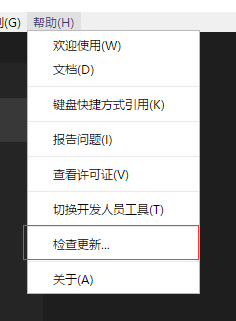
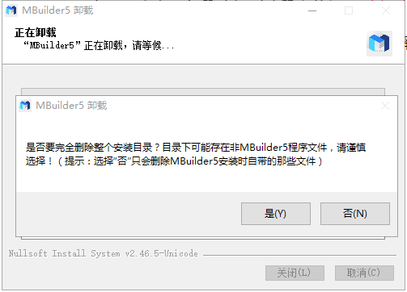

# 安装、升级、卸载  

----------

<h2 id="cid_0">win32</h2>

<h3>安装</h3>

1.运行安装文件 (文件名根据实际情况而定)

 

2.选择安装目录（目录中不要包含中文和空格）

 

3.安装过程

 

 

<h3>升级</h3>

点击帮助菜单下的检查更新，即可查询是否存在新版本

 

点击立即更新，MBuilder会自动关闭并打开安装包

 

<h3>卸载</h3>

进入安装目录下，找到unins000.exe文件，双击执行即可完成卸载

 

在卸载过程中，会提示是否清空整个目录，如果目录下存在个人文件，建议选择“否”，这时只会删除MBuilder5安装的时候自带的那些文件。

<h2 id="cid_1">mac64</h2>

<h3>安装</h3>

1.运行dmg安装文件 (文件名根据实际情况而定)

 

拖动左侧的MBuilder5图标至右边应用程序目录，稍等片刻即可完成安装，安装完成后可以在应用程序目录或者Launchpad中找到MBuilder5程序。

<h3>升级</h3>

Mac版本升级和Windows版本类似，点击检查更新菜单即可，更新完成后直接自动重启生效。

<h3>卸载</h3>

Mac版本没有专门的卸载程序，直接到应用程序目录删除即可。

 