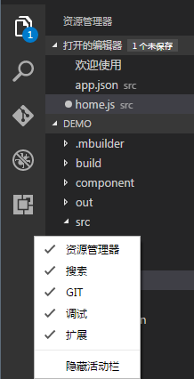

# 用户界面

----------

MBuilder5基于vscode定制开发，所以整体界面和vscode非常相似。

整体的界面和其他代码编辑器一样，采用了顶部是菜单及工具栏，左侧是资源管理器，右侧是编辑区，底部是输出及状态栏这样一个通用的界面。

**菜单栏-**和vscode类似，菜单栏包含了整个MBuilder的大部分的功能和配置选项。

**工具栏-**从左至右依次是新建、导出、导出、新窗口打开、设备列表、后台任务、登陆和注册。

**活动栏-**从上至下依次是资源管理器、搜索、源码管理（GIT）、调试和拓展。

- **搜索**-在打开文件夹中提供全局搜索和替换。

- **源码控制**（GIT）-默认包含Git源代码控制拓展。

- **调试**-代码的调试视图显示变量、调用堆栈和断点。

- **拓展**-安装和管理MBuilder的扩展

活动栏在空白区域右击鼠标可以控制功能模块和自身的显示隐藏。

**编辑区域：**支持绝大多数格式文件的编辑、着色、代码提示。

**控制台-**日志、命令、问题等。

