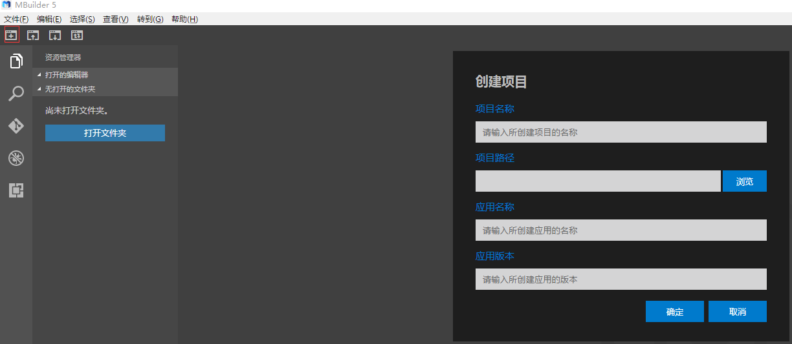
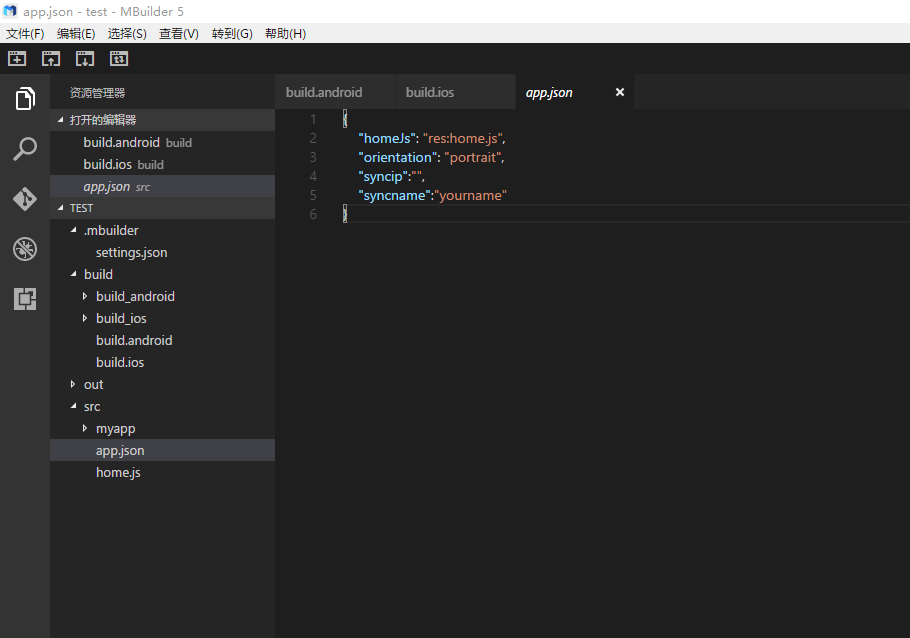
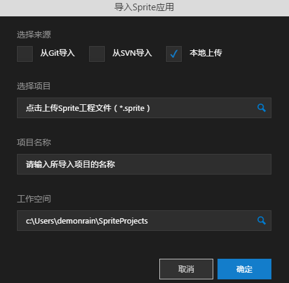
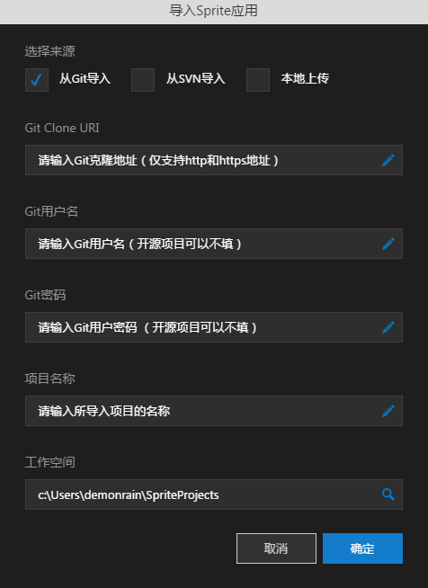
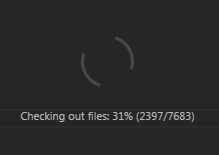
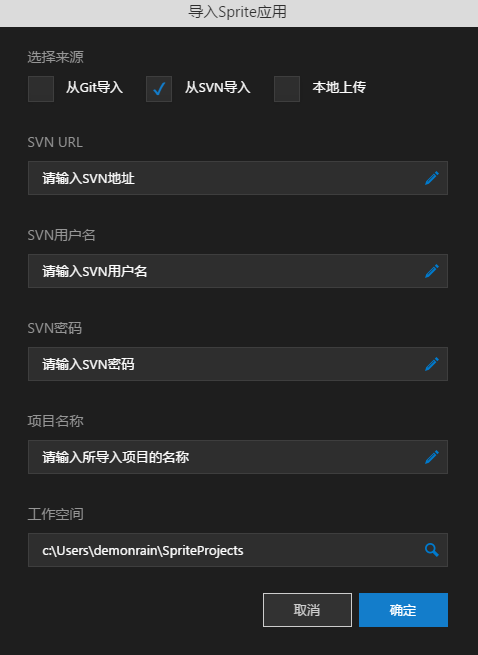

# 新建Sprite项目

----------

工具栏上点击"创建Sprite应用"，可以创建一个Sprite项目。

**项目名称：**项目的名称，例如：test。

**工作空间：**工作空间路径。

例如：C:\MyWorkSpace（默认为C:\Users\用户\SpriteProjects）

**选择模板：**MBuilder5内置了默认、项目、新闻三种模板，方面用户上手。（上图中所选择的模板是项目模板）

**是否打开新窗口：**选择“是”，则在新窗口中创建一个Sprite应用。

新建完成后如下所示：

**Sprite应用基本结构如下：**

- **.mbuilder：**MBuilder的一些配置文件

- **build/package：**打包配置与相关资源

- **component：**Sprite官方组件

- **out：**代码编译之后的目录

- **out_build/package：**打包、构建结果

- **src：**源码

- **src/app.json：**Sprite应用入口文件

- **src/require.json：**Sprite应用引用配置文件

- **typings、jsconfig.json：**代码提示相关文件

# 导入Sprite项目

----------

点击工具栏上导入按钮，导入分为从Git、SVN、本地上传三种模式，默认为本地上传模式。

- **本地上传-**可以导入一个Sprite项目，Sprite项目格式以.sprite结尾。

- **从Git导入-**从git仓库拉取一个项目到选中的目录，目前只支持http和https协议的地址。

导入完成后，mbuilder会在新的窗口中打开刚才导入的项目。

- **从SVN导入-**从SVN仓库拉取一个项目到选中的目录

# 导出Sprite项目

----------

点击工具栏上的导出按钮，可以导出一个以.sprite结尾的文件，这个就是Sprite项目文件。

# 新窗口打开Sprite项目

----------

点击工具栏上的新窗口打开按钮，可以在新窗口打开一个新的Sprite项目。