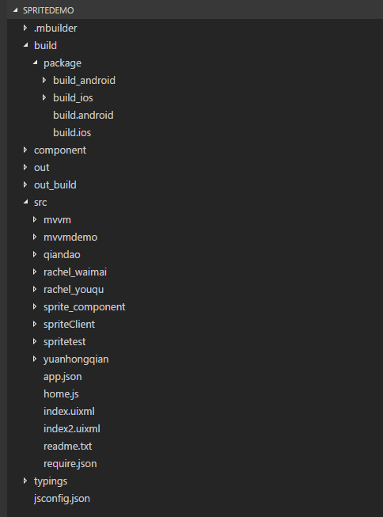

# 新建Sprite项目

----------

工具栏上点击新建，可以创建一个Sprite项目

项目名称：项目的名称，例如：test

工作空间：工作空间路径，例如：C:\MyWorkSpace

选择模板：MBuilder5内置了一批简单的模板，方面用户上手，例如：测试模板

是否打开新窗口：选择“是”，则在新窗口中创建一个Sprite应用

新建完成后如下所示：

Sprite应用基本结构如下：

.mbuilder：MBuilder的一些配置文件

build/package：打包配置与相关资源

component：Sprite官方组件

out：代码编译之后的目录

out_build/package：打包、构建结果

src：源码

src/app.json：Sprite应用入口文件

src/require.json：Sprite应用引用配置文件

typings、jsconfig.json：代码提示相关文件

# 导入Sprite项目

----------

点击工具栏上导入按钮，可以导入一个Sprite项目，Sprite项目格式以.sprite结尾

# 导出Sprite项目

----------

点击工具栏上的导出按钮，可以导出一个以.sprite结尾的文件，这个就是Sprite项目文件。

# 新窗口打开Sprite项目

----------

点击工具栏上的新窗口打开按钮，可以在新窗口打开一个新的Sprite项目。