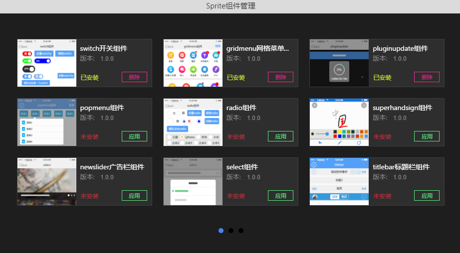

# Sprite组件使用

----------

component目录右键点击“Sprite组件管理”，就可以使用官方提供的Sprite组件了

界面上可以点击相关按钮可以下载使用、删除Sprite组件

点击“应用”时，组件会被自动下载到component目录，同时require.json文件的componentPaths节点会自动配置组件引用，例如："switchUI": "${component:switch}"

点击“删除”时，component目录中的组件会被自动删除，同时require.json文件的componentPaths节点中的相关引用配置也会被同步删除