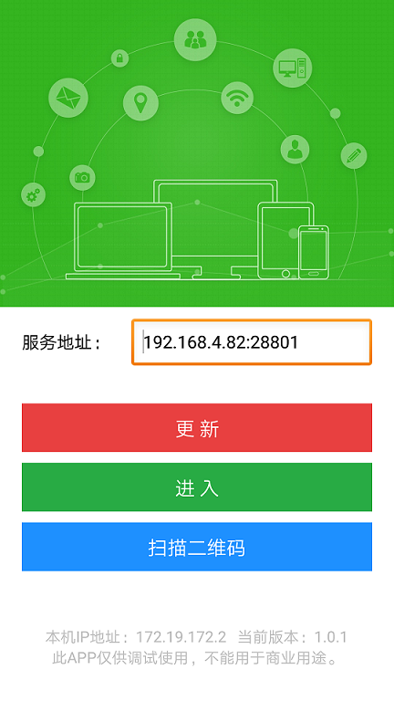

# Sprite应用调试

----------

点击工具栏的"设备列表"钮，可以看到一个下面的界面

右侧是二维码，可以扫描安装Sprite调试客户端。

如果是苹果手机，在扫码完成后需要在safari浏览器中打开地址，然后点击安装即可。

安装Sprite调试客户端后，打开首先会进入调试参数配置界面，入下图所示：

**配置IP、端口有两种方式：**

- **自动配置-**点击工具栏上的"设备列表"按钮，把鼠标移至图中红框位置，即可使用Sprite调试客户端中的"扫描二维码"功能自动配置

- **手动配置-**手动输入上图中下拉框中的ip及端口号，一般来说这个ip为内网ip。

配置完成后，点击更新或进入，此时设备会自动连接到MBuilder上（需确保手机和MBuilder处于同一网段中）

备注：全量更新期间，请勿操作代码，以免造成代码不同步

# Sprite日志输出

----------

下面的控制台中，找到输出，选择Sprite，可以看到日志输出面板，在Sprite中使用日志打印方法时，这里看到日志。

