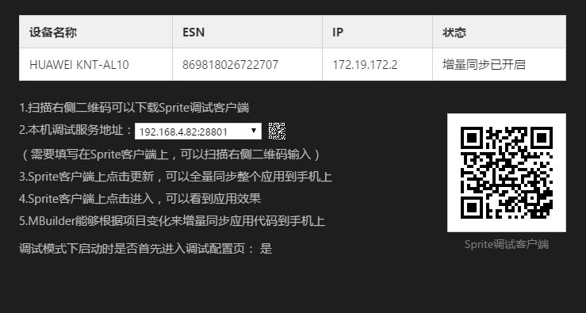

# Sprite应用调试

----------

点击代码同步按钮，可以看到一个下面的界面

右侧是二维码，可以扫描安装Sprite调试客户端。

安装Sprite调试客户端后，打开首先会进入调试参数配置界面，入下图所示：

配置IP、端口后，点击更新或进入，此时设备会自动连接到MBuilder上（需确保手机和MBuilder处于同一网段中）

备注：全量更新期间，请勿操作代码，以免造成代码不同步

# Sprite日志输出

----------

下面的控制台中，找到输出，选择Sprite，可以看到日志输出面板，在Sprite中使用日志打印方法时，这里看到日志。

