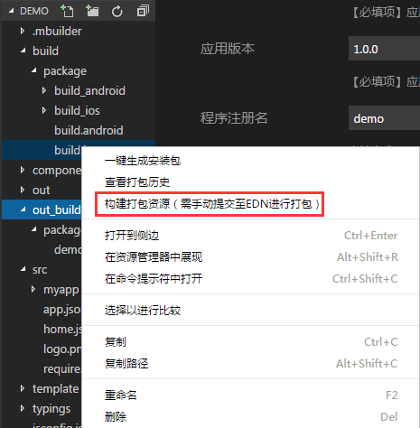
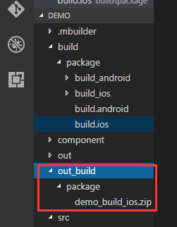
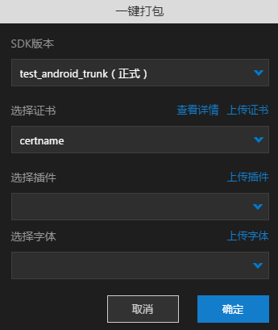
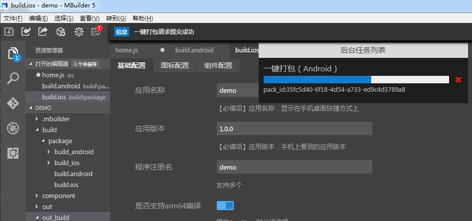
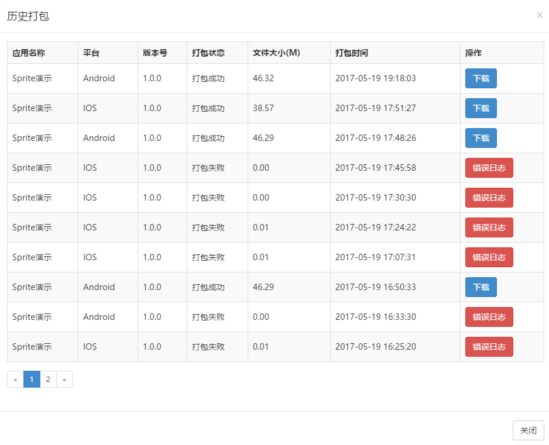

# Sprite应用打包 

----------
## 手动打包 ##
**- 构建打包资源**

在build.ios或者build.android文件上右键点击"构建打包资源"，可以在out_build目录中构建出一个zip包，这个包可以上传到EDN上进行打包。

## 自动打包 ##
**- 一键生成安装包**

这个功能需要在已登录的状态下进行，若未登录状态，会提示先进行登录操作。在build.ios或者build.android文件上右键点击"一键生成安装包"，这时会在工具栏的后台任务中多出一项打包任务。

如果打包失败，out_build目录中则生成错误日志文件

在build.ios或者build.android文件上右键点击"查看打包历史"，则可以直接看到该应用的所有打包历史记录，同时支持下载安装包与错误日志

