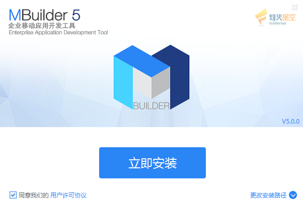
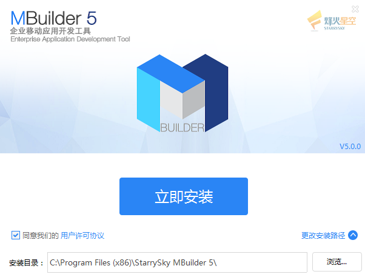
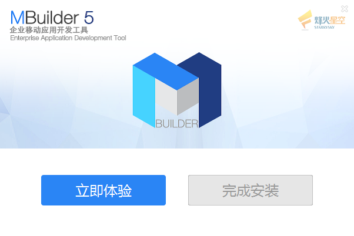
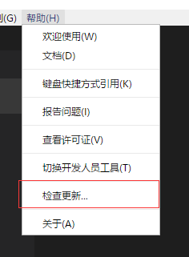
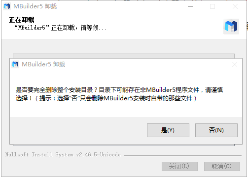

# 安装、升级、卸载  

----------

<h2 id="cid_0">win32</h2>

<h3>安装</h3>

1.运行安装文件 (文件名根据实际情况而定)

 

2.选择安装目录（目录中不要包含中文和空格）

 

3.安装过程

 

 

<h3>升级</h3>

点击帮助菜单下的检查更新，即可查询是否存在新版本

 

点击立即更新，MBuilder会自动关闭并打开安装包

 

<h3>卸载</h3>

进入安装目录下，找到unins000.exe文件，双击执行即可完成卸载

 

在卸载过程中，会提示是否清空整个目录，如果目录下存在个人文件，建议选择“否”，这时只会删除MBuilder5安装的时候自带的那些文件。

<h2 id="cid_1">darwin</h2>

<h3>安装</h3>

Mac版本不需要安装，直接解压使用即可

<h3>升级</h3>

Mac版本暂不支持升级

<h3>卸载</h3>

Mac版本没有卸载过程，直接删除即可