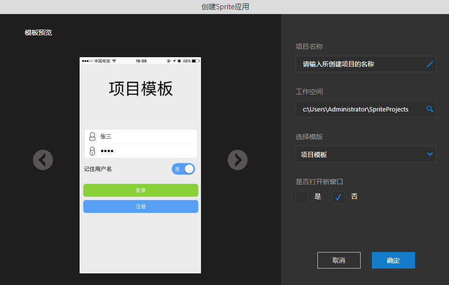

# 新建Sprite项目

----------

工具栏上点击新建，可以创建一个Sprite项目

项目名称：项目的名称，例如：test

项目路径：工作空间路径，例如：C:\MyWorkSpace

应用名称：应用的名称，打包后会显示在手机桌面上，例如：测试应用

应用版本：应用的版本号，例如：1.0.0

新建完成后如下所示

MBuilder默认生成一个Sprite应用模板，基本结构如下：

.mbuilder：MBuilder的一些配置文件

build：打包配置与资源

out：构建之后的打包资源

src：源码