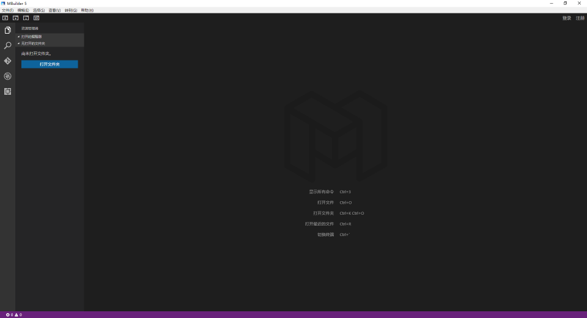
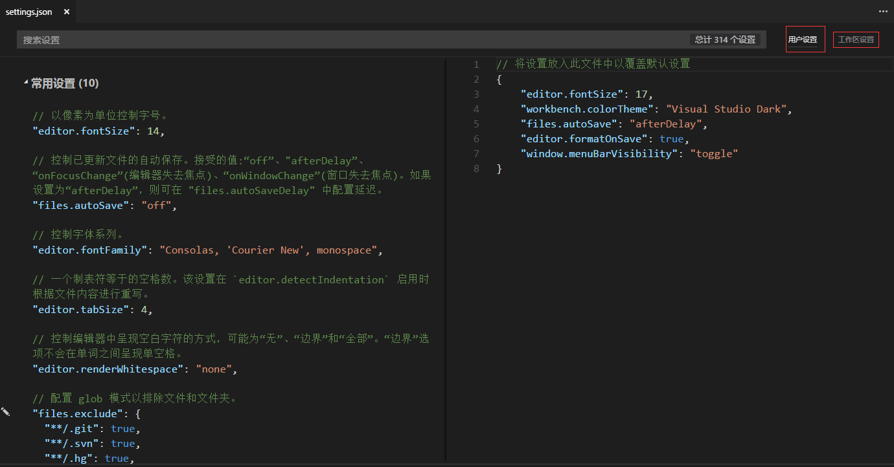

# 启动与设置

----------

<h2 id="cid_0">启动</h2>

启动后界面如下图所示

<h2 id="cid_1">设置</h2>

打开文件-首选项-设置，即可看到配置页面，这里有所有的参数配置

配置分为用户设置和工作区设置两种
用户设置：全局生效，适用于所有的工作区
工作区设置：仅本工作区生效，配置会覆盖用户设置，设置完成后工作区中会多出一个.mbuilder/settings.json配置文件